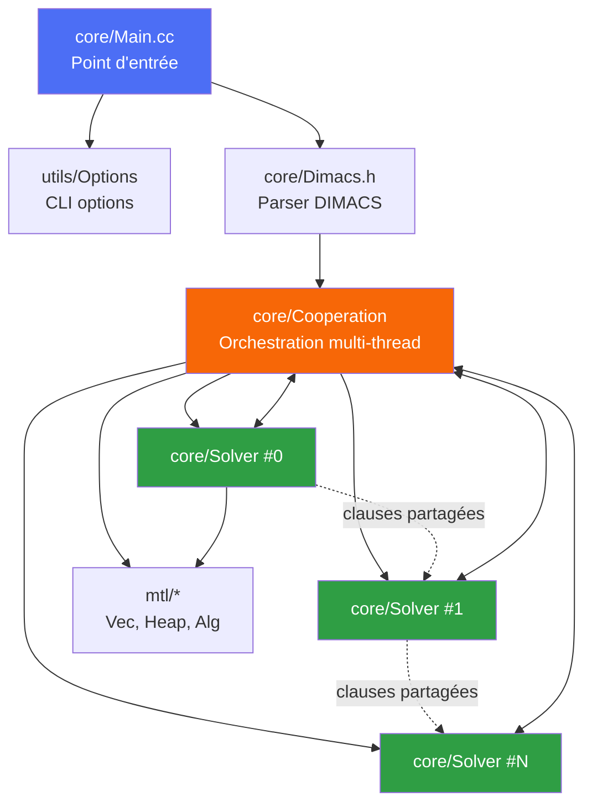
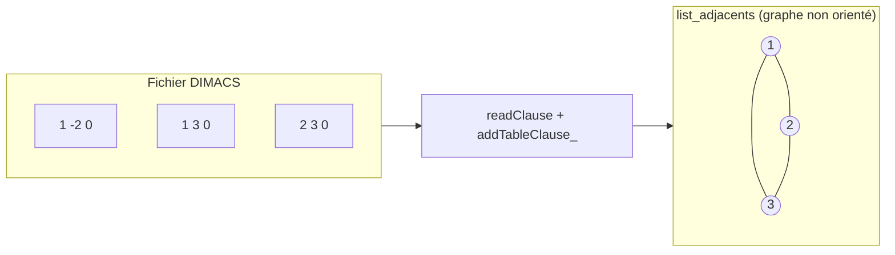
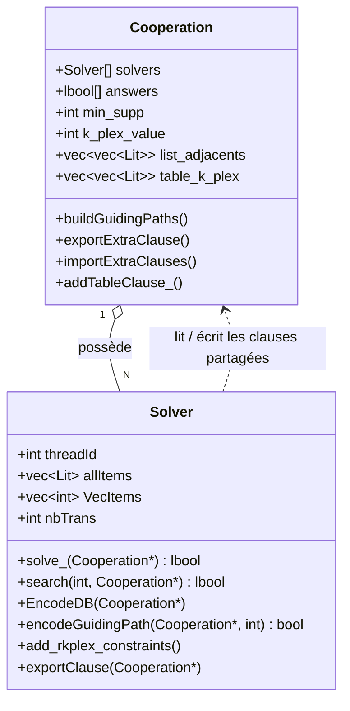
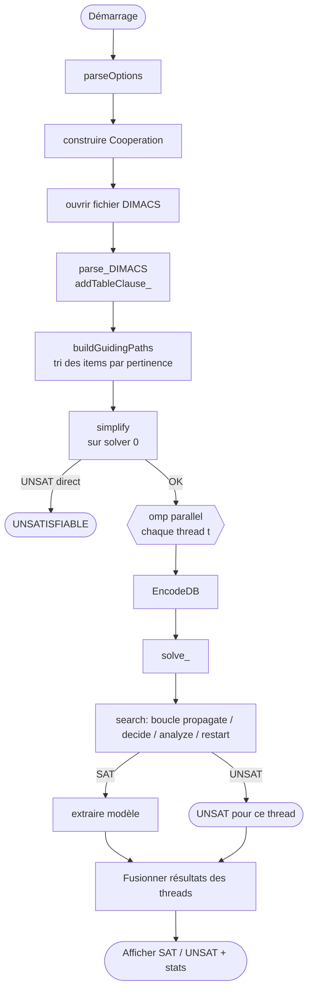
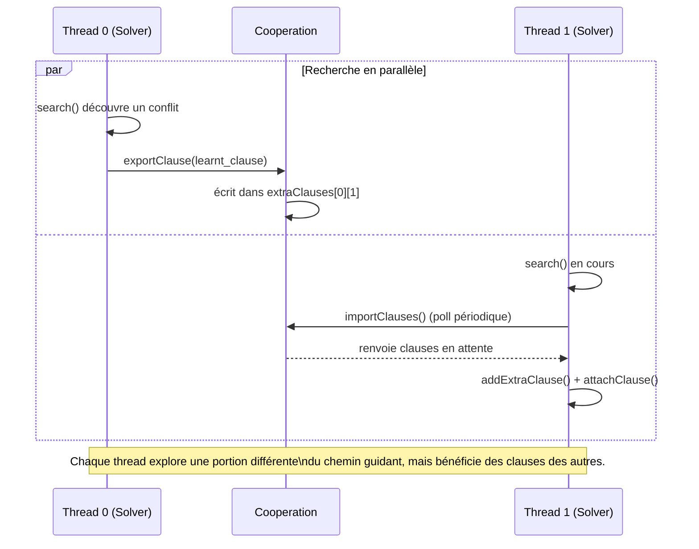

# Walkthrough du programme SAT4DSEV3

Ce document est conçu pour que vous puissiez comprendre le programme, le refaire vous-même, et le modifier sans avoir à tout deviner. Il cible aussi bien les débutants que les développeurs expérimentés.

Le projet est un solveur SAT parallèle orienté vers l’énumération de k-plex, avec un mécanisme de partage de clauses entre threads. Il s’appuie fortement sur l’architecture MiniSat, mais ajoute une couche supplémentaire de gestion de graphes, de contraintes guidées par des chemins, et de contraintes d’optimisation sur les k-plex.

---

## 1. Ce que fait le programme

Le programme lit un problème SAT encodé en DIMACS, puis exécute une recherche SAT parallèle en plusieurs threads. La particularité ici est que le solveur ne se contente pas de résoudre une formule SAT : il encode aussi un problème de structure combinatoire autour des k-plex et il guide la recherche avec des chemins et des contraintes spécifiques.

En gros, il fait ceci :

1. Lit un fichier DIMACS.
2. Représente les données sous forme de variables/clauses SAT.
3. Construit des structures de voisinage / chemins / graphes internes.
4. Encode les contraintes liées au k-plex.
5. Lance plusieurs solveurs sur des threads.
6. Partage des clauses apprises entre threads.
7. Résume les modèles trouvés et affiche le résultat.

---

## 2. Architecture du projet

### 2.1. Arborescence principale

- `core/Main.cc` : point d’entrée du programme.
- `core/Solver.h` : interface de la classe `Solver`, cœur du moteur SAT.
- `core/Solver.cc` : implémentation logique du solveur, encoding, propagation, recherche.
- `core/Cooperation.h` : gestion du parallélisme et du partage de clauses entre threads.
- `core/Cooperation.cc` : logique de partage, construction de chemins guidants, voisinages.
- `core/Dimacs.h` : parsing des fichiers DIMACS.
- `mtl/` : bibliothèques utilitaires (vecteurs, tas, algorithmes, etc.).
- `utils/` : options, parsing, gestion système.
- `doc/` : documentation et notes de version.

### 2.1 bis. Schéma des composants



Lecture du schéma : `Main.cc` construit un seul objet `Cooperation`, qui possède un tableau de `Solver` (un par thread). Chaque `Solver` peut lire/écrire dans les files de `Cooperation` pour partager des clauses avec les autres.

### 2.2. Le cœur : MiniSat modifié

Le solveur est très proche de MiniSat :

- variables
- clauses originales et clauses apprises
- propagation unitaire
- heuristique de branchement
- restarts
- clauses de travail
- gestion des niveaux de décision

Mais le projet ajoute une logique métier spécifique :

- `Cooperation` gère plusieurs solveurs en parallèle
- `Solver::EncodeDB` prépare la base de données pour la recherche
- `encodeGuidingPath` construit des contraintes selon le chemin de guidage
- `add_rkplex_constraints` ajoute des contraintes liées au k-plex
- `exportClause` / `importExtraClauses` permettent le partage inter-thread

---

## 3. Le point d’entrée : `Main.cc`

Le fichier `core/Main.cc` est le chef d’orchestre.

### 3.1. Ce qu’il fait en ordre

1. Configure les options de ligne de commande.
2. Crée un objet `Cooperation`.
3. Initialise les paramètres du k-plex.
4. Ouvre le fichier DIMACS.
5. Parse le fichier et construit les structures internes.
6. Simplifie le problème.
7. Lance les threads.
8. Affiche les résultats.

### 3.2. Les options importantes

Dans `Main.cc`, on voit des options comme :

- `--verb` : verbosité
- `--cpu-lim` : limite CPU
- `--mem-lim` : limite mémoire
- `--ncores` : nombre de threads
- `--limitEx` : taille limite des clauses exportées
- `--ctrl` : mode de contrôle du partage de clauses
- `--min-size` : taille minimale support / k-plex
- `--k` : valeur du k-plex

Exemple de logique clé :

```cpp
IntOption    kplex   ("MAIN", "k", "k-plex value (k=1 for cliques)", 2, IntRange(1, INT32_MAX));
...
coop.k_plex_value = kplex-1;
```

Ici, la valeur du k-plex est convertie en un paramètre interne. Le code ne traite pas exactement la valeur saisie comme “k” brut ; il l’ajuste selon la logique interne.

### 3.3. L’appel central

Le point le plus important est ici :

```cpp
#pragma omp parallel
{
  int t = omp_get_thread_num();
  coop.start = true;
  coop.solvers[t].EncodeDB(&coop);
  ret = coop.solvers[t].solve_(&coop);
}
```

Cela veut dire :

- chaque thread possède un `Solver`
- chaque thread prépare ses données internes (`EncodeDB`)
- chaque thread exécute `solve_()`
- les threads partagent des clauses via `Cooperation`

---

## 4. La phase de parsing DIMACS

Le fichier `core/Dimacs.h` contient le parser.

### 4.1. Rôle du parser

Le parser lit les lignes DIMACS, par exemple :

```text
p cnf 3 2
1 -2 0
-1 3 0
```

et transforme chaque clause en éléments SAT.

### 4.2. Ce qui se passe ensuite

La fonction `parse_DIMACS_main` appelle :

```cpp
readClause(in, coop, lits);
coop->addTableClause_(lits);
```

La méthode `addTableClause_` n’ajoute pas seulement une clause SAT classique ; elle remplit les structures internes autour des graphes / voisinages :

```cpp
list_adjacents[a].push(ps[1]);
list_adjacents[b].push(ps[0]);
```

Cela signifie que le programme reconstruit des liens de voisinage à partir des clauses lues, ce qui servira ensuite pour la génération du k-plex et des chemins guidants.

### 4.3. Explication de la logique “graph-like”

Le projet n’est pas seulement SAT “classic”. Il encode des structures de graphe implicites dans des vecteurs :

- `list_adjacents` : liste des voisins d’un sommet / variable
- `table_k_plex` : voisinage à distance k
- `VecGuiding` : chemins guidants
- `appearTrans`, `occ`, `dist`, `seen` : structures de parcours

Cela alimente la partie “modèle combinatoire” de la résolution.

#### Exemple visuel : d’une clause DIMACS à un graphe



Chaque clause binaire `(a, b)` lue dans le DIMACS devient une arête entre les sommets `a` et `b` dans `list_adjacents`. C'est cette structure qui sert ensuite de base pour calculer les voisinages à distance k (`table_k_plex`) utilisés par le k-plex.

---

## 5. Les classes principales

## 5.1. `Solver`

La classe `Solver` est le cœur du moteur SAT classique. Elle héberge les mécanismes de MiniSat :

- `newVar()`
- `addClause()`
- `solve_()`
- `propagate()`
- `analyze()`
- `cancelUntil()`
- `search()`
- `garbageCollect()`

On y trouve aussi des variables très spécifiques :

- `allItems` : ensemble d’éléments que le solveur traite
- `VecItems` : éléments triés par priorité
- `nbTrans` : nombre de transactions / sous-structures
- `blocking_clauses` : clauses de blocage
- `transClos` : fermeture transitive
- `isTrans` : variables de transaction

### Idée claire

`Solver` est à la fois :

- un moteur SAT standard,
- et un moteur de recherche guidée par les objets combinatoires du projet.

## 5.2. `Cooperation`

La classe `Cooperation` coordonne les threads.

Elle contient :

- `solvers[]` : tableau des solveurs
- `answers[]` : résultat de chaque thread
- `extraUnits` : unités exportées entre threads
- `extraClauses` : clauses exportées entre threads
- `headExtraUnits`, `tailExtraUnits` : files de messages
- `pairwiseLimitExportClauses` : limite de partage par paire de threads

C’est le point de contrôle pour :

- produire des clauses exportées,
- les recevoir,
- les importer dans les solveurs,
- gérer les limites de partage.

### 5.3. Schéma de relation entre les classes



---

## 6. Comment le solveur démarre réellement

Le flux typique est le suivant :

```text
Main::main
  -> parseOptions
  -> construire Cooperation
  -> ouvrir DIMACS
  -> parse_DIMACS
  -> buildGuidingPaths
  -> simplify
  -> EncodeDB
  -> solve_
  -> search
  -> afficher résultat
```

### 6.0. Schéma du flux d’exécution



### 6.1. `buildGuidingPaths()`

C’est une étape très importante du projet. Elle construit les structures qui servent à guider la recherche.

Dans `Cooperation.cc`, on trouve :

- `neighboors_distance_k()`
- `neighboors_distance2_k()`
- `buildGuidingPaths()`

Cette méthode trie les éléments (`items`) de manière à favoriser les variables qui semblent plus pertinentes. La recherche est donc guidée par des caractéristiques structurales du graphe / du problème.

### 6.2. Pourquoi ça existe ?

Parce que le programme n’essaie pas de résoudre “une instance SAT quelconque” de façon naïve. Il cherche une configuration de k-plex ou de sous-structures, donc il sélectionne intelligemment quelles variables ou sous-structures explorer en priorité.

---

## 7. La partie “SAT” principale : `solve_()`

La méthode clé est :

```cpp
lbool Solver::solve_(Cooperation* coop)
```

### 7.1. Qu’elle fait

- remet les compteurs à zéro
- initialise les variables temporaires (`bl`, `cl`, `dl`)
- détermine le nombre de variables
- choisit le chemin guidant (`encodeGuidingPath`)
- lance ensuite la recherche principale

### 7.2. La boucle de recherche

```cpp
while (status == l_Undef){
  double rest_base = luby_restart ? luby(restart_inc, curr_restarts) : pow(restart_inc, curr_restarts);
  status = search(rest_base * restart_first, coop);
  if (!withinBudget()) break;
  curr_restarts++;
}
```

Cela correspond à la logique de MiniSat :

- on cherche un modèle,
- on réessaie après un restart,
- la stratégie de restart peut suivre la séquence Luby.

### 7.3. `search()`

`search()` est le moteur de résolution SAT proprement dit. Il contient les mécanismes standard :

- propagation
- choix de variable
- décision
- analyse de conflits
- génération de clauses apprises
- restarts et gestion de budgets

Si vous souhaitez modifier le solveur, c’est là qu’il faut aller.

---

## 8. La partie “k-plex” / encoding spécifique

Le projet ajoute une logique bien particulière dans `encodeGuidingPath()` et `add_rkplex_constraints()`.

### 8.1. `encodeGuidingPath()`

Cette fonction :

- prend un élément du graphe / de la structure
- récupère les voisins ou la zone à distance k
- construit des contraintes sur ces sommets
- force le respect de la cardinalité / support minimal
- ajoute des clauses utiles à la recherche

Des éléments clés ici :

```cpp
if (2 * coop->list_adjacents[var(pp)].size() < coop->min_supp) {
  ok = false;
  return false;
}
```

Cela bloque immédiatement les cas qui ne peuvent pas respect le support minimal.

### 8.2. `gen_pigeon_cardinality()`

Cette fonction construit des schémas de cardinalité (type “pigeonhole/at least” constraints). C’est un mécanisme de codage SAT classique pour exprimer qu’au moins `b` éléments doivent être vrais, ou qu’un ensemble ne peut pas dépasser une certaine taille.

Elle est particulièrement utile pour exprimer des contraintes structurelles du type :

- “au moins x éléments doivent appartenir au sous-groupe”
- “un sommet ne peut être que dans telle configuration”
- “dans le voisinage, on impose un seuil”

### 8.3. `add_rkplex_constraints()`

Cette fonction ajoute des contraintes de voisinage / distance / fermeture selon la notion de k-plex. Si vous voulez comprendre le vrai “problème métier”, c’est ici qu’il faut regarder.

---

## 9. Le parallélisme et la coopération entre threads

### 9.1. Le but du partage de clauses

Chaque thread résout sa branche mais peut exporter certaines clauses ou unités qu’il a apprises.

Dans `Cooperation.h` on voit :

- `extraUnits`
- `extraClauses`
- `headExtraUnits`, `tailExtraUnits`
- `headExtraClauses`, `tailExtraClauses`

C’est une structure de file circulaire :

- un thread écrit une clause exportée,
- un autre thread la lit,
- elle est ajoutée à son solveur,
- la recherche se trouve enrichie sans repartir à zéro.

### 9.1 bis. Schéma de séquence du partage de clauses



Ce diagramme montre que le partage n'est pas un verrou bloquant : chaque thread écrit dans sa propre file de sortie (`extraClauses[id][dest]`) et lit dans sa propre file d'entrée, ce qui évite les blocages entre threads.

### 9.2. La logique export/import

Dans `Solver.cc`, on trouve :

- `exportClause()`
- `addExtraClause()`
- `propagateExtraUnits()`
- `importClauses()`

Le mécanisme est typique d’un SAT parallèle avec partage de clauses :

- si une clause de conflit ou de propagation intéressante est trouvée
- elle est exportée
- les autres threads l’importent
- cela réduit le nombre de branches répétitives

### 9.3. Les limites de partage

Dans `Main.cc` et `Cooperation.h` on constate :

- `limitEx` : taille limite des clauses exportées
- `ctrl` : mode de contrôle du partage
- `pairwiseLimitExportClauses` : limite dépendant du couple de threads

Cela sert à éviter d’envoyer trop de clauses trop grandes, ce qui peut devenir coûteux.

---

## 10. Le modèle mental le plus simple

Voici une version très lisible du programme.

```text
Le programme = moteur SAT + gestion de graphes + exécution parallèle

1. On lit le problème.
2. On convertit les données en représentation interne.
3. On construit des relations de voisinage.
4. On encode les contraintes du k-plex.
5. Chaque thread exécute une recherche SAT guidée.
6. Les threads se partagent des clauses utiles.
7. Le solveur renvoie SAT/UNSAT et éventuellement un modèle.
```

---

## 11. Les fichiers à lire si vous voulez modifier le code

### Si vous voulez changer la logique de parsing

- `core/Dimacs.h`
- `core/Main.cc`

### Si vous voulez modifier le moteur SAT

- `core/Solver.h`
- `core/Solver.cc`

### Si vous voulez modifier le parallélisme

- `core/Cooperation.h`
- `core/Cooperation.cc`

### Si vous voulez changer les options CLI

- `core/Main.cc`
- `utils/Options.h`, `utils/Options.cc`

### Si vous voulez comprendre les structures de base utiles

- `mtl/Vec.h`
- `mtl/Heap.h`
- `mtl/Alg.h`

---

## 12. Comment recommencer à partir de zéro

Si vous vouliez refaire ce projet seul, je vous conseille cette progression :

### Étape 1 : recréer un MiniSat minimal

Implémentez :

- variables
- clauses
- propagation unitaire
- décision
- analyse de conflit
- clauses apprises

### Étape 2 : ajouter le parallélisme

Ajoutez :

- plusieurs solveurs
- partage de clauses
- échange d’unités et de clauses apprises

### Étape 3 : ajouter le problème métier

Ajoutez :

- listes de voisinage (`list_adjacents`)
- contraintes de fermeture
- distances / support minimal
- codage SAT du k-plex

### Étape 4 : ajouter le guidage

Implémentez :

- génération de chemins
- tri de variables par pertinence
- branchement plus intelligent

### Étape 5 : optimiser

- limiter les exports de clauses
- contrôler la taille des clauses
- gérer la mémoire
- réduire les restarts inutiles

---

## 13. Ce que j’ai vérifié dans le projet

J’ai compilé le projet dans son état actuel avec la commande :

```bash
cd '.../SAT4DSEV3/core' && make -j2
```

et la compilation a échoué dans ce workspace à cause du chemin du dossier contenant des espaces (`Listing k plex`). Le Makefile est construit avec des chemins non quotés, ce qui empêche la commande de se lancer correctement dans cet environnement.

Cela ne signifie pas que le code est faux ; cela signifie simplement que pour le compiler sainement, il faut éviter les espaces dans le chemin du projet, ou corriger le `Makefile` / les chemins.

Exemple de bonne pratique :

```bash
mkdir -p /tmp/sat4dsev3
cp -r . /tmp/sat4dsev3
cd /tmp/sat4dsev3/core
make
```

---

## 14. Résumé très court

Si je devais résumer ce projet en une phrase :

> C’est un solveur SAT parallèle inspiré de MiniSat, enrichi d’un codage combinatoire pour la recherche de k-plex et d’un mécanisme de partage de clauses entre threads.

Et si je devais donner le point d’entrée le plus important :

- `core/Main.cc` pour lancer le programme
- `core/Cooperation.h` pour le parallélisme
- `core/Solver.cc` pour le cœur SAT et le codage métier
- `core/Dimacs.h` pour le parsing

---

## 15. Recommandation pour la lecture

Pour comprendre réellement le code, je recommande cette lecture dans l’ordre :

1. `core/Main.cc`
2. `core/Dimacs.h`
3. `core/Cooperation.h`
4. `core/Solver.h`
5. `core/Cooperation.cc`
6. `core/Solver.cc`
7. `mtl/*` si besoin de primitives de structures

Cela donne la perspective du programme dans le bon ordre : entrée → parsing → préparation → recherche → partage → résultat.

---

## 16. Conclusion

Ce projet est un excellent exemple de solveur SAT “professionnel” modifié pour un cas spécifique de recherche combinatoire. Le point clé est qu’il n’est pas seulement un solveur SAT standard : il mélange le moteur SAT, la gestion de graphes, le guidage de recherche, et le partage de clauses entre threads.

Si vous comprenez ce pipeline, vous pouvez :

- le modifier très librement,
- explorer d’autres contraintes combinatoires,
- ajouter de nouveaux types de clauses,
- modifier les heuristiques,
- ou le reprogrammer dans un cadre plus simple à votre mesure.

---

Si vous voulez, je peux maintenant vous préparer une deuxième version encore plus pédagogique sous forme :

- de schéma de flux complet,
- de carte mentale de chaque fichier,
- ou d’un guide de refonte “mini MiniSat” en version plus simple à lire et modifier.
